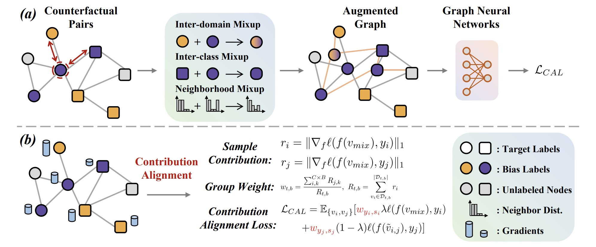
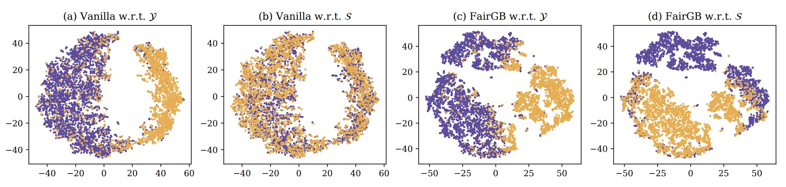

# Rethinking Fair Graph Neural Networks from Re-balancing

>This is the official implementation of the following paper:
>
>Rethinking Fair Graph Neural Networks from Re-balancing (SIGKDD'2024)

<p align="left"></p>

<p align="left"></p>

## Table of Contents

- [Rethinking Fair Graph Neural Networks from Re-balancing](#rethinking-fair-graph-neural-networks-from-re-balancing)
  - [Dependencies](#dependencies)
  - [Datasets](#datasets)
  - [Running](#running)
  - [Additional Experiments](#additional-experiments)

## Dependencies
* python>=3.7
* torch==2.0.1
* torch-geometric==2.3.1
* torch-scatter==2.1.1
* numpy==1.24.4
* scikit-learn==1.3.0

## Datasets

We conduct experiments on three widely used real-world datasets, namely German Credit, Bail, and Credit Defaulter. The detailed information of the datasets is as follows. Please unzip datasets in ```./dataset``` before running the model.

|Dataset|German|Bail|Credit|
|---|---|---|---|
|# Nodes|1,000|18,876|30,000|
|# Edges|22,242|321,308|152,377|
|# Attributes|27|18|13|
|Sens.|Gender|Race|Age|
|Label|Credit status|Bail decision|Future default|

## Running

The ```run.sh``` includes details to reproduce experimental results in the paper:

```
bash run.sh
```

## Acknowledgement

Our code is based on the FairVGNN (Improving fairness in graph neural networks via mitigating sensitive attribute leakage) and GraphENS (Graphens: Neighbor-aware ego network synthesis for class-imbalanced node classification).